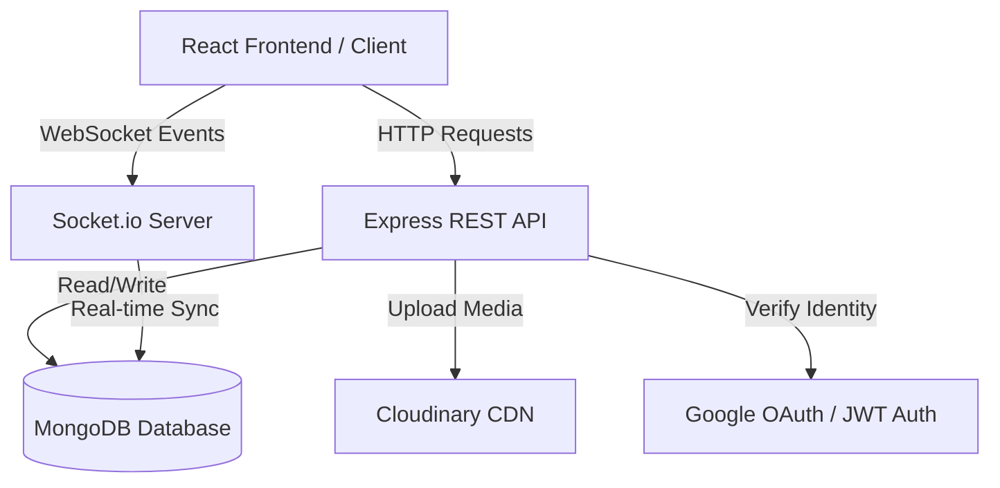
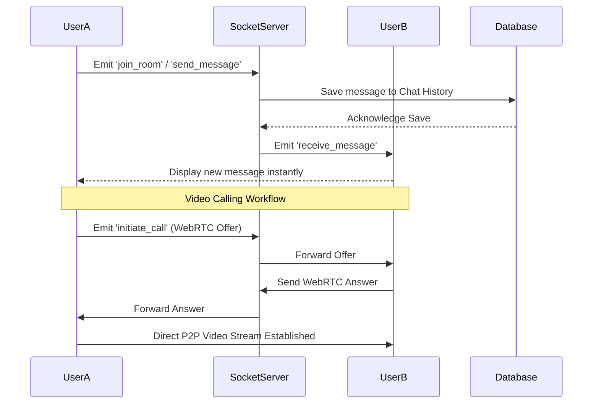
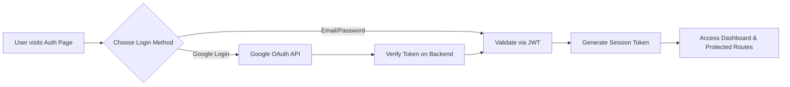

# 🌐 Coll-Connect


**Coll-Connect** is a comprehensive, real-time social communication and networking platform designed to seamlessly connect users through instant messaging, video rooms, and anonymous community boards. Built with a modern, scalable MERN stack (MongoDB, Express, React, Node.js) and powered by WebSockets for real-time interactivity.

---

## ✨ Key Features

- **🔐 Secure Authentication**: JWT-based authentication combined with Google OAuth for seamless and secure user onboarding.
- **💬 Real-Time Messaging**: Instant one-on-one chatting powered by Socket.io, with real-time read receipts, typing indicators, and online status.
- **📹 Video Rooms**: Integrated high-quality video calling capabilities for face-to-face virtual meetings and hangouts.
- **🤫 Whisper Board**: An anonymous public board where users can share confessions, thoughts, and announcements without revealing their identity.
- **🧑‍🤝‍🧑 Friend System**: Send, accept, and manage friend requests. Build your personal network and view rich user profiles.
- **🖼️ Profile & Media Management**: Fully customizable user profiles with image cropping, avatar uploading, and media storage powered by Cloudinary.
- **🛡️ Admin & SuperAdmin Dashboards**: Advanced moderation tools, analytics (Recharts), report handling, and support ticket management for platform administrators.

---

## 🛠️ Technology Stack

### Frontend (Client-Side)
- **Framework**: React.js (Vite)
- **Routing**: React Router DOM
- **Real-Time**: Socket.io-client
- **Styling**: Tailwind CSS & Lucide Icons
- **Data Visualization**: Recharts
- **Media**: React Image Crop & HTML2Canvas

### Backend (Server-Side)
- **Runtime**: Node.js
- **Framework**: Express.js
- **Database**: MongoDB (Mongoose ORM)
- **Real-Time**: Socket.io
- **Auth**: JSON Web Tokens (JWT) & Google Auth Library
- **File Uploads**: Multer & Cloudinary
- **Emails**: Nodemailer

---

## 🏗️ System Architecture & Workflows

### 1. High-Level System Architecture


### 2. Real-Time Chat & Video Workflow


### 3. Authentication Flow


---

## 🚀 Installation & Setup

### Prerequisites
- Node.js (v16 or higher)
- MongoDB (Local or Atlas URL)
- Cloudinary Account (for media uploads)

### 1. Clone the Repository
```bash
git clone https://github.com/satyamtyagi15/COLL-CONNECT.git
cd COLL-CONNECT
```

### 2. Backend Setup
```bash
cd backend
npm install
```
Create a `.env` file in the `backend` directory and add the following:
```env
PORT=5000
MONGO_URI=your_mongodb_connection_string
JWT_SECRET=your_jwt_secret
CLOUDINARY_CLOUD_NAME=your_cloud_name
CLOUDINARY_API_KEY=your_api_key
CLOUDINARY_API_SECRET=your_api_secret
GOOGLE_CLIENT_ID=your_google_client_id
```
Run the backend server:
```bash
npm run dev
```

### 3. Frontend Setup
```bash
cd frontend
npm install
```
Create a `.env` file in the `frontend` directory:
```env
VITE_API_URL=http://localhost:5000
VITE_GOOGLE_CLIENT_ID=your_google_client_id
```
Run the frontend server:
```bash
npm run dev
```

---

## 📜 License

This project is licensed under the MIT License.
